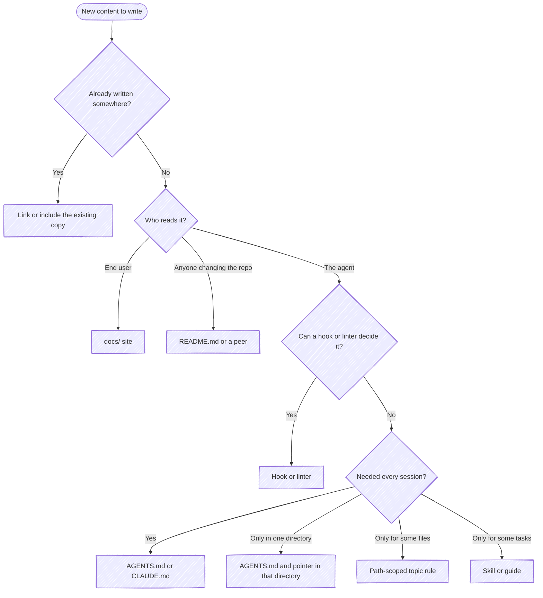
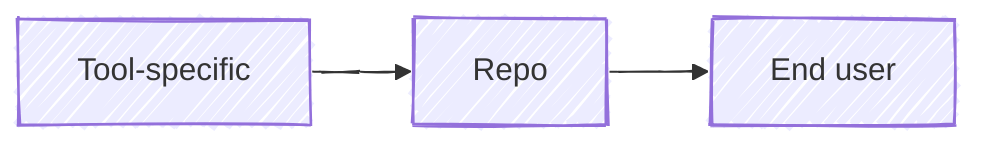

# Where new content goes

cleat names this guide when a write adds guidance to an instruction file or a
topic rule. Its audience tiers and link direction also explain the `restated`
and `narrowing-ref` findings. Each piece of content has one intended reader. It belongs in
the file that reader consults, written once and linked from everywhere else.

## The placement tree

The rest of this guide is the reasoning behind each branch. The split between
`AGENTS.md` and `CLAUDE.md` has its own rubric:
[Which guidance goes where](./agents-vs-claude.md).

## Why one reader per file

Each reader arrives with a different question and different context. An end
user wants to know what the project does for them and has no checkout. A
maintainer or an agent changing the repo wants to know how it's built and what
conventions it holds to. Content written for two of them at once answers
neither well: the end user wades through build steps, and the agent pays
context for a sales pitch.

The same reasoning rules out copies. Two copies of a setup procedure drift the
moment one is edited, and neither reader can tell which is current. Keep one
copy, in the file its reader consults, and link to it or pull it in with an
include (docsify's `:include`) everywhere else. `restated` reports the copies
cleat finds.

Small, stable content can be shared freely: a one-line pitch, a title. The trap
is a substantive copy, so cleat looks for a run of shared lines rather than one,
held by exactly two files. A run every page starts from is a template, not a
copy. A generated projection isn't a copy either. It's rendered from its source
and can't drift, so cleat skips any file git ignores or marks
`linguist-generated` in `.gitattributes`.

## Guidance for the agent

Pick the kind of guidance by when it has to reach the agent:

| Kind | Where it lives |
|---|---|
| Always-on feedforward | `AGENTS.md`, always-on rules |
| Just-in-time feedforward | A path-scoped rule loading on a read, a hook adding guidance before a call |
| Advisory feedback | A `PostToolUse` report, a failing test |
| Blocking feedback | A `PreToolUse` deny, a failing gate |

- **A hook first, when one can decide it.** A constraint decidable from a single
  tool call's own inputs (a branch name in a command, a path in a write, a flag)
  belongs in a hook. A hook costs nothing until it fires and acts on what the
  agent did rather than on what it was told. As a rule, "branch names match
  `[a-z-]+`" rides along in every session; as a hook, it denies the bad name in
  the one command that creates it.
- **Block only what one call reveals precisely.** A hook sees one tool call and
  none of the context around it, so it can't tell a mistake from a correct use
  that looks the same. Block where the mistake is costly or hard to undo (a
  push, a deploy, a deleted file), and advise where the call needs judgment.
- **Just-in-time over always-on.** Everything always-on is paid for in every
  session, whether that session needs it or not, and competes with every other
  always-on line: the more an agent carries, the less reliably it honors each.
  Just-in-time guidance arrives with its trigger, specific to what the agent is
  doing right then.
- **Don't shout.** Rewriting an ignored rule as `IMPORTANT: ...` rarely changes
  what the agent does, and it can backfire: a nag that never stops gets tuned
  out. Move the rule to where it applies instead.
- **Always-on for what every session needs:** what the project is, how to build
  and test it, the words it uses. Keep the set small enough that each line in
  `AGENTS.md` applies to nearly every session.

The background for these choices, with what each kind costs, is on the docs
site:
[Harness engineering](https://chris-peterson.github.io/cleat/#/harness-engineering).

## Guidance for one directory

Put guidance bound to one directory in an `AGENTS.md` there, with a `CLAUDE.md`
beside it holding `@AGENTS.md`. Without that pointer Claude Code never reads the
nested file, because the root `CLAUDE.md` turns off its direct `AGENTS.md`
reading for the whole tree. cleat reports the missing pointer as `shadowed`.

| Bound to | Put it in |
|---|---|
| One directory | That directory's `AGENTS.md`, plus the pointer |
| A file type across the tree | A path-scoped rule under the root's `.claude/rules/`, indexed from the root `AGENTS.md` |
| A file type within one directory | A rule under that directory's `.claude/rules/`, its globs relative to that directory, indexed from that directory's `AGENTS.md` |

How each tool loads a nested file is on the docs site:
[Nested instruction files](https://chris-peterson.github.io/cleat/#/feedback-loops?id=nested-instruction-files).

## Audience tiers

Each file sits in a tier, decided by its path:

| Tier | Reader | Files |
|---|---|---|
| Tool-specific | The one agent tool that loads it | `CLAUDE.md`, `SKILL.md`, `.claude/` outside `.claude/rules/`, a rival tool's config |
| Repo | Anyone changing the repository, person or agent | `README.md`, `CONTRIBUTING.md`, `AGENTS.md`, topic rules, the spec, everything else |
| End user | Someone using what the repo ships | `docs/` |

Maintainers and agents share a tier because they do the same work. `README.md`
can send a maintainer to `AGENTS.md` for the conventions, and `AGENTS.md` can
send an agent to `README.md` for the architecture.

## Why links point toward the wider audience

A file may link to its own tier or a wider one, never a narrower one:

A reader can always use material written for a wider audience, but not the
reverse. Claude Code can read `AGENTS.md`, while Cursor has no use for
`CLAUDE.md`. A maintainer can read the docs site, while an end user has no
checkout to follow a link into. So:

- `CLAUDE.md` links to `AGENTS.md`: that's the pointer shape.
- `AGENTS.md` and `README.md` link to `docs/` for anything an end user also
  needs to know.
- `docs/` links only to other `docs/` pages and to sites outside the repo. End
  user documentation stands alone.

A link the other way is `narrowing-ref`. `AGENTS.md` pointing at `CLAUDE.md` is
the same mistake, reported as `inverted`, and it leaves every other tool reading
a stub.

When `restated` finds a copy in two tiers, keep the one in the wider tier and
link to or include it from the narrower. When both copies sit in the repo tier,
keep the one whose reader acts on it and link from the other.

## Why a finding can be overridden

The agent decides. cleat's checks decide facts (a copy exists, a link points
the wrong way), but whether a given copy or link is the right call is judgment,
and the agent in the session has context cleat doesn't. So a deny stops a write
once. Re-issue the identical write and it goes through, and cleat stays quiet
about that finding for the rest of the session. A later session that touches
the same file will raise it again.
