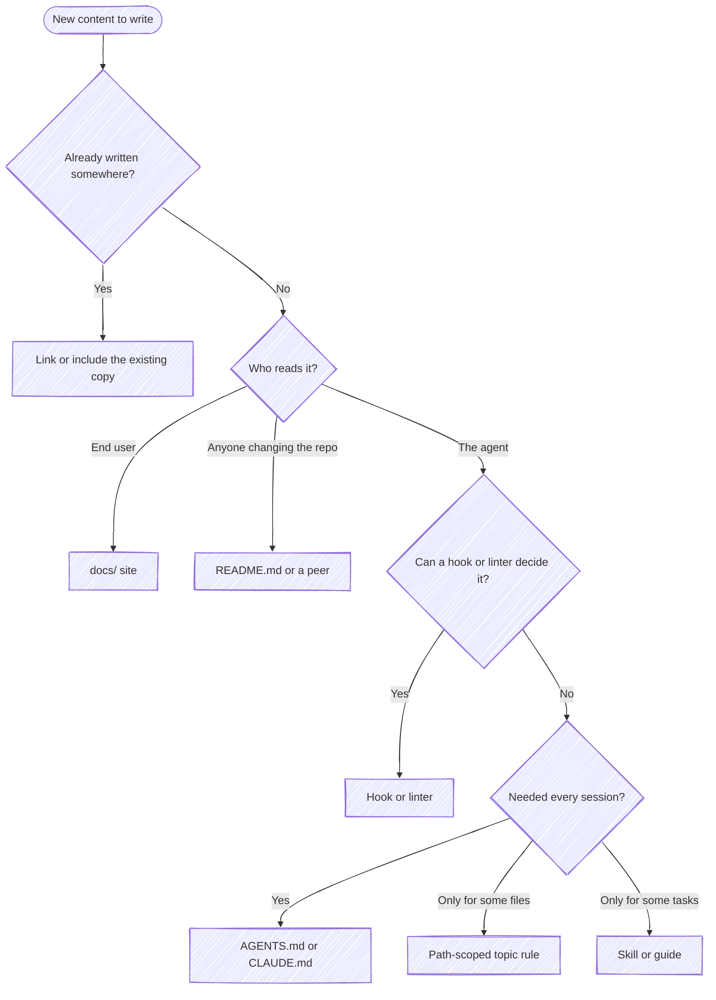
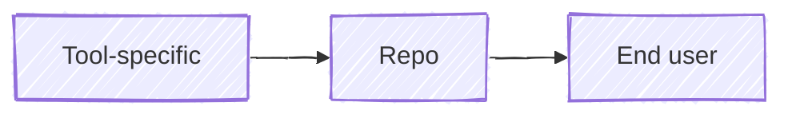

# Where new content goes

cleat names this guide when a write adds guidance to an instruction file, when
two documentation files carry the same content, and when a link points toward a
narrower audience. Each piece of content has one intended reader. It belongs in
the file that reader consults, written once and linked from everywhere else.

## The placement tree

The rest of this guide is the reasoning behind each branch. The split between
`AGENTS.md` and `CLAUDE.md` has its own rubric:
[Which guidance goes where](./agents-vs-claude.md).

## Why one reader per file

Each reader arrives with a different question and different context. An end
user wants to know what the project does for them and has no checkout. A
maintainer or an agent changing the repo wants to know how it's built and what
conventions it holds to. Content written for two of them at once answers
neither well: the end user wades through build steps, and the agent pays
context for a sales pitch.

The same reasoning rules out copies. Two copies of a setup procedure drift the
moment one is edited, and neither reader can tell which is current. Keep one
copy, in the file its reader consults, and link to it or pull it in with an
include (docsify's `:include`) everywhere else. `restated` reports the copies
cleat finds.

Small, stable content can be shared freely: a one-line pitch, a title. The trap
is a substantive copy, so cleat looks for a run of shared lines rather than one,
held by exactly two files. A run every page starts from is a template, not a
copy. A generated projection isn't a copy either. It's rendered from its source
and can't drift, so cleat skips any file git ignores or marks
`linguist-generated` in `.gitattributes`.

## Why the moment of action

Picture a toddler reaching for a hot stove. There are four points where the
toddler can learn the stove is hot:

| When | At the stove | For an agent | Kind |
|---|---|---|---|
| Every morning | "Stoves are hot." | `AGENTS.md`, always-on rules | Always-on feedforward |
| The hand moves toward the stove | "Careful, that's hot." | A path-scoped rule loading on a read, a hook adding guidance before a call | Just-in-time feedforward |
| The hand is about to land | The parent catches the hand | A `PreToolUse` deny, a failing gate | Blocking feedback |
| After the touch | The burn | A `PostToolUse` report, a failing test | Advisory feedback |

Feedforward acts before the agent does and makes a mistake less likely.
Feedback acts after, and is the only thing that catches one. The more of the
correction the agent makes itself, within the session, the more the result is
decided by the loop rather than by the agent's first attempt. The toddler still
decides at every point. Heeding the warning avoids the burn. Ignoring it still
teaches, because the burn is feedback too. It just isn't the outcome anyone
wanted.

**Why just-in-time over always-on.** The morning lecture is said once, hours
before the stove, alongside everything else the toddler hears that day, and it
doesn't say which stove. The warning at the stove names the exact hazard at the
moment the choice is made. Instruction files work the same way:

- Everything always-on is paid for in every session, whether that session goes
  near the stove or not.
- Every always-on instruction competes with every other one. The more an agent
  carries, the less reliably it honors each.
- A just-in-time instruction arrives with its trigger, so it's specific to what
  the agent is doing right then.
- A just-in-time instruction can be measured: it fires, and the agent's next
  action either follows it or doesn't. An always-on instruction's effect only
  shows when you ablate it, running without it and comparing.

**Why a hook first, when one can decide it.** A hook costs nothing until it
fires, acts on what the agent actually did rather than on what it was told, and
can't be forgotten halfway through a long session. A constraint decidable from a
single tool call's own inputs (a branch name in a command, a path in a write, a
flag) belongs in a hook. A convention like "branch names match `[a-z-]+`" is
the typical case: as a rule, it rides along in every session; as a hook, it
denies the bad name in the one command that creates it. Keep prose for what
needs judgment across the turn, the diff, or the user's intent.

**How much the burn costs decides how early to warn.** For a toddler every burn
hurts. For an agent most are cheap: a failed test, then a rewrite. Some can't be
undone: a push, a deleted file, a deploy, a message sent to someone. The more a
mistake costs, the more it's worth catching the hand before it lands.

**When always-on is right.** Some guidance is needed before any trigger could
fire: what the project is, how to build and test it, the words it uses. That
belongs in `AGENTS.md`. Keep the set small enough that each line in it applies
to nearly every session.

cleat follows its own advice. Nothing of it loads at launch. Its gate stops a
write before it lands, and its nudge reports right after one. That's also why
it asks where new guidance belongs at the write rather than earlier: a hook
sees what the agent does, not what it suggests in chat, so the question arrives
when the agent acts on a preference instead of when it recommends one. The
session that answers pays one round trip; every later session that would have
carried the misplaced line is the one that benefits.

### How to tell whether it's working

Each kind fails differently, so each has its own measure:

- **Always-on feedforward**: whether the mistake it exists to prevent still
  happens. If the matching feedback keeps firing, the instruction isn't working.
- **Just-in-time feedforward**: how often it loads where it doesn't apply. A
  rule whose globs match too much turns into always-on feedforward at a higher
  price.
- **Feedback**: how often it fires, and how often the agent acts on it. A deny
  that's re-issued unchanged every time is noise, and the rule behind it belongs
  in a narrower place or nowhere.

Further reading: Birgitta Böckeler's
[Harness engineering for coding agent users](https://martinfowler.com/articles/exploring-gen-ai/harness-engineering.html)
frames the harness as feedforward guides and feedback sensors, and the
Thoughtworks Technology Radar's
[Feedback sensors for coding agents](https://www.thoughtworks.com/radar/techniques/feedback-sensors-for-coding-agents)
recommends running those sensors in the session, before a commit.

## Audience tiers

Each file sits in a tier, decided by its path:

| Tier | Reader | Files |
|---|---|---|
| Tool-specific | The one agent tool that loads it | `CLAUDE.md`, `SKILL.md`, `.claude/` outside `.claude/rules/`, a rival tool's config |
| Repo | Anyone changing the repository, person or agent | `README.md`, `CONTRIBUTING.md`, `AGENTS.md`, topic rules, the spec, everything else |
| End user | Someone using what the repo ships | `docs/` |

Maintainers and agents share a tier because they do the same work. `README.md`
can send a maintainer to `AGENTS.md` for the conventions, and `AGENTS.md` can
send an agent to `README.md` for the architecture.

## Why links point toward the wider audience

A file may link to its own tier or a wider one, never a narrower one:

A reader can always use material written for a wider audience, but not the
reverse. Claude Code can read `AGENTS.md`, while Cursor has no use for
`CLAUDE.md`. A maintainer can read the docs site, while an end user has no
checkout to follow a link into. So:

- `CLAUDE.md` links to `AGENTS.md`: that's the pointer shape.
- `AGENTS.md` and `README.md` link to `docs/` for anything an end user also
  needs to know.
- `docs/` links only to other `docs/` pages and to sites outside the repo. End
  user documentation stands alone.

A link the other way is `narrowing-ref`. `AGENTS.md` pointing at `CLAUDE.md` is
the same mistake, reported as `inverted`, and it leaves every other tool reading
a stub.

When `restated` finds a copy in two tiers, keep the one in the wider tier and
link to or include it from the narrower. When both copies sit in the repo tier,
keep the one whose reader acts on it and link from the other.

## Why a finding can be overridden

The toddler decides. cleat's checks decide facts (a copy exists, a link points
the wrong way), but whether a given copy or link is the right call is judgment,
and the agent in the session has context cleat doesn't. So a deny stops a write
once. Re-issue the identical write and it goes through, and cleat stays quiet
about that finding for the rest of the session. A later session that touches
the same file will raise it again.
